# Zero-Knowledge Anonymous ECDSA Attestation

> **A Rust implementation of a privacy-preserving attestation protocol for ECDSA signatures using Homomorphic Linearization.**

## 📄 Abstract

Remote Attestation is a critical security primitive, yet standard protocols compromise user privacy by treating digital signatures as persistent identifiers. This project implements a **Zero-Knowledge Proof of Knowledge (ZK-PoK)** that allows a Prover to demonstrate possession of a valid ECDSA signature without revealing the signature itself **or the identity of the signer**.

By employing **Homomorphic Hiding** on the linearized ECDSA verification equation, we replace the public key $Q$ with a Pedersen commitment $C_Q$. This transforms the standard ECDSA verification into a **Double-Base Schnorr Proof**, achieving Identity Anonymity with sub-millisecond proving times (~146 µs).

---

## 🔍 The Research Problem

In standard authentication (e.g., FIDO, JWT, TPM Attestation), a user sends a signature $(r, s)$ and a public key $Q$ to a server.

- **Privacy Leak 1 (Identity):** The Public Key $Q$ is a unique, static identifier that allows the server to track the user across sessions.
- **Privacy Leak 2 (Signature):** The signature scalar $s$ is revealed, which is unnecessary for simple validity checks.

**The Goal:** Prove that "I know a signature $(r, s)$ valid for _some_ key inside a commitment $C_Q$" without revealing $s$ or $Q$.

---

## 📐 Methodology: Homomorphic Linearization

We cannot use standard Schnorr proofs because ECDSA is non-linear ($s^{-1}$). We apply a two-step transformation to make it compatible with Sigma protocols.

### 1. Linearization

Standard ECDSA verification:
$$R = s^{-1}(z \cdot G + r \cdot Q)$$

We multiply by $s$ to linearize the relation:
$$s \cdot R = z \cdot G + r \cdot Q$$

### 2. Homomorphic Hiding (The Novelty)

To hide the Public Key $Q$, we commit to it using a second generator $H$ (derived via `HashToCurve` for transparency):
$$C_Q = Q + \rho \cdot H$$

We substitute $Q = C_Q - \rho \cdot H$ into the linearized equation:
$$s \cdot R = z \cdot G + r \cdot (C_Q - \rho \cdot H)$$

Rearranging terms to isolate secrets on the left:
$$s \cdot R + (r \cdot \rho) \cdot H = z \cdot G + r \cdot C_Q$$

### 3. The Double-Base Schnorr Proof

The Prover now proves knowledge of two secrets:

1.  **The Signature:** $s$ (Base $R$)
2.  **The Blinding Factor:** $x = r \cdot \rho$ (Base $H$)

The protocol becomes a generalized Schnorr proof over two bases.

---

## ⚡ Performance Benchmarks

Benchmarks run on a consumer CPU using `criterion.rs`.

| Operation            | Mean Time            | Throughput     | Cost of Anonymity\* |
| :------------------- | :------------------- | :------------- | :------------------ |
| **Proof Generation** | **146 µs** (0.15 ms) | ~6,800 ops/sec | ~2.0x vs Standard   |
| **Verification**     | **319 µs** (0.32 ms) | ~3,100 ops/sec | ~1.25x vs Standard  |

> **Analysis:** The introduction of Identity Anonymity introduces a predictable computational overhead. Proving time doubles because the commitment $T$ now requires two scalar multiplications ($T = \alpha_1 R + \alpha_2 H$) instead of one. Despite this, the protocol remains orders of magnitude faster than SNARK-based alternatives (which typically take 10ms–100ms).

---

## 📚 Protocol Flow

The protocol is non-interactive via the Strong Fiat-Shamir transformation.

```mermaid
sequenceDiagram
    participant P as Prover (Alice)
    participant V as Verifier (Bob)
    Note over P: Secrets: s, rho<br/>Public: R, C_Q, m

    rect rgb(240, 248, 255)
    note right of P: 1. Setup & Commit
    P->>P: Sample random α1, α2
    P->>P: T = (α1 * R) + (α2 * H)
    end

    rect rgb(255, 250, 240)
    note right of P: 2. Fiat-Shamir Challenge
    P->>P: c = SHA256(T || R || C_Q || m)
    end

    rect rgb(240, 255, 240)
    note right of P: 3. Double-Base Response
    P->>P: z1 = α1 + c * s
    P->>P: z2 = α2 + c * (r * rho)
    end

    P->>V: Send Proof π = {T, z1, z2}

    rect rgb(255, 230, 230)
    note right of V: 4. Verification
    V->>V: Reconstruct c
    V->>V: Target = zG + r * C_Q
    V->>V: Check: z1*R + z2*H == T + c*Target
    end
```

## 🔒 Security & Limitations

**Security Properties**

- **Completeness**: If the Prover is honest, the equation $sR + r\rho H = zG + rC_Q$ holds mathematically.
- **Soundness (Binding)**: Relying on the Discrete Logarithm assumption, a cheating Prover cannot find a collision for $T$ or satisfy the equation without knowing $s$ and $\rho$.
- **Perfect Zero-Knowledge**: The responses $z_1, z_2$ are uniformly distributed random values (due to blinding by $\alpha_1, \alpha_2$).

**Discussion: Anonymity vs. Unlinkability**

While this system achieves Identity Anonymity (Bob sees $C_Q$, not $Q$), it does not provide perfect Session Unlinkability.

- Limitation: The verification equation requires the nonce point $R$ as a public input.
- Implication: If Alice reuses the exact same signature $(r, s)$ for multiple proofs, the value $R$ acts as a correlation token.
- Mitigation: This protocol is best suited for scenarios using fresh signatures per session, or where identity hiding is paramount (e.g., anonymous whistleblowing) even if session linking is possible.
