# ZK-ECDSA Attestation: Privacy-Preserving Signature Proofs

> **A Rust implementation of a Non-Interactive Zero-Knowledge (NIZK) protocol for proving possession of valid ECDSA signatures without revealing the signature itself.**


## 📖 Overview

This library provides a Zero-Knowledge wrapper around standard ECDSA signatures (Secp256k1). It addresses a core problem in Remote Attestation: **Identity Privacy**.

In standard attestation (e.g., TPM, SGX), a device presents a signature $(r, s)$ to prove its state. However, this signature acts as a static identifier, allowing the verifier to track the device across sessions.

**This project solves that by proving knowledge of the signature in Zero-Knowledge.** The Prover convinces the Verifier that "I possess a valid signature" without ever revealing the signature scalar $s$.

## 📐 The Cryptography

To enable Zero-Knowledge proofs for ECDSA, we utilize a **Linearization Technique** to transform the non-linear modular inverse equation into a form compatible with Schnorr-style Sigma protocols.

### 1. The Transformation
Standard ECDSA verification checks:
$$R = s^{-1}(z \cdot G + r \cdot Q)$$

We linearize this by multiplying by $s$:
$$s \cdot R = z \cdot G + r \cdot Q$$

### 2. The ZK Relation
The Prover proves knowledge of the secret witness $s$ satisfying the relation:
$$s \cdot \text{Base} = \text{Target}$$

Where:
* **Secret:** $s$ (The hidden signature scalar)
* **Base:** $R$ (The nonce point from the signature)
* **Target:** $z \cdot G + r \cdot Q$ (Computed publicly by the Verifier)

### 3. Non-Interactivity (NIZK)
We employ the **Strong Fiat-Shamir Heuristic** to transform the interactive Sigma protocol into a non-interactive proof. The challenge $c$ is derived via a cryptographic hash of the transcript:
$$c = \text{SHA256}(\text{DomainSeparator} || T || R || Q || z)$$

---

## 🚀 Features

* **Secp256k1 Support:** Built on top of the `k256` crate (standard for Bitcoin/Ethereum).
* **Modular Architecture:** Strict separation of `Prover`, `Verifier`, and `Transcript` logic.
* **Replay Protection:** Transcript hashing includes public inputs and domain separation tags.
* **Type Safety:** Leverages Rust's type system to distinguish between `Scalar`, `ProjectivePoint`, and `Witness` types.
* **Comprehensive Testing:** Includes integration tests verifying end-to-end flows.

---

## 📂 Project Structure

```text
zk-ecdsa-attest/
├── Cargo.toml            # Dependencies (k256, sha2, rand)
├── src/
│   ├── lib.rs            # Library entry point & module exports
│   ├── transcript.rs     # Shared Fiat-Shamir hashing logic
│   ├── prover.rs         # Prover logic (Commit -> Respond)
│   ├── verifier.rs       # Verifier logic (Reconstruct -> Check)
│   └── main.rs           # CLI Demo (The "Story")
└── tests/
    └── integration_test.rs # End-to-End integration tests
└── beenches/
    └── proof_benchmark.rs # Benchmarking the proof generation
```

## 🔒 Security Analysis

### Soundness (Binding)
The protocol ensures that a false prover cannot convince the verifier. This relies on the **Discrete Logarithm Assumption** of the Secp256k1 curve. Specifically, the commitment $T = \alpha \cdot R$ acts as a binding factor; finding a collision in $T$ without knowing $\alpha$ is computationally infeasible.

### Zero-Knowledge (Hiding)
The response $z = \alpha + c \cdot s$ perfectly hides the secret $s$. Since $\alpha$ is drawn from a uniform distribution, the resulting $z$ is statistically indistinguishable from random noise to anyone who does not know $\alpha$. This provides **Perfect Zero-Knowledge**.

### Non-Interactivity & Replay Protection
We implement the **Strong Fiat-Shamir Transformation**. The challenge $c$ is derived via a cryptographic hash of the transcript:
$$c = H(T \ || \ R \ || \ Q \ || \ m)$$
By including the public context ($R, Q, m$) in the hash, we ensure the proof is bound to the specific session, preventing replay attacks across different messages or identities.

---

## ⚡ Performance Benchmarks

Benchmarks run on [Insert Your CPU Here] using `criterion.rs`.

| Operation | Time (Mean) | Throughput |
| :--- | :--- | :--- |
| **Proof Generation** | **78 µs** (0.078 ms) | ~12,800 ops/sec |
| **Verification** | **256 µs** (0.256 ms) | ~3,900 ops/sec |

> **Analysis:** The protocol achieves sub-millisecond latency, making it suitable for high-frequency authentication systems and real-time remote attestation without introducing perceptible delays.

---

## 📚 Protocol Flow

```mermaid
sequenceDiagram
    participant P as Prover (Alice)
    participant V as Verifier (Bob)
    Note over P: Know Secret s, Public (R, Q, m)
    
    rect rgb(240, 248, 255)
    note right of P: 1. Commitment Phase
    P->>P: Sample random α
    P->>P: T = α * R
    end

    rect rgb(255, 250, 240)
    note right of P: 2. Fiat-Shamir (Non-Interactive)
    P->>P: c = SHA256(T || R || Q || m)
    end

    rect rgb(240, 255, 240)
    note right of P: 3. Response Phase
    P->>P: z_resp = α + c * s
    end

    P->>V: Send Proof π = {T, z_resp}

    rect rgb(255, 230, 230)
    note right of V: 4. Verification
    V->>V: Reconstruct c = SHA256(T || R || Q || m)
    V->>V: Target = zG + rQ
    V->>V: Check: z_resp * R == T + c * Target
    end
```


